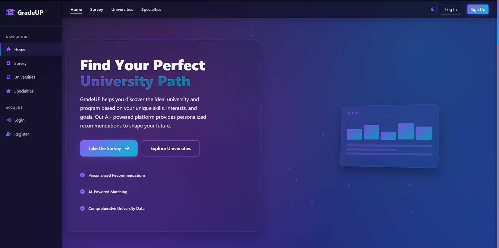

# 🎓 GradeUp - School Recommendation System


A web application that helps students find the perfect educational institution based on their preferences and needs.
## 📸 Preview

>Take a quick look at **Grade Up** in action:

<table>
  <tr>
    <td align="center">
      
      <br/>Home Screen
    </td>
    <td align="center">
      
      <br/>Welcome Back Page
    </td>
  </tr>
  <tr>
    <td align="center">
      
      <br/>Dashboard
    </td>
    <td align="center">
      
      <br/>Survey
    </td>
  </tr>
</table>

---

## 🛠️ Contributors

### Backend 👨‍💻
> [KRRusev21](https://github.com/KRRusev21) |
> [TPIvanov21](https://github.com/TPIvanov21)

### Designers 🎨
> [PSDineva21](https://github.com/PSDineva21) |
> [GYFilipov21](https://github.com/GYFilipov21)

### Scrum Master 🧑‍🏫
> [SGMikov21](https://github.com/SGMikov21)
---
## 🚀 Features

- 🔐User authentication (registration, login, profile management)  
- 🎓Student dashboard with personalized recommendations  
- 🛠️ Admin panel for user and system management  
- 🏫 School and program browsing  
- ⭐ Favorites system to save and compare schools
>You can view the full list of user stories [here](documentation/UserStories_GradeUp).
---

## 🛠️ Installation

1. **Clone the repository:**
   ```bash
   git clone https://github.com/your-username/school-recommendation-system.git
   cd school-recommendation-system
   ```

2. **Create a virtual environment:**
   ```bash
   python -m venv venv
   ```

3. **Activate the virtual environment:**
   - **Windows:**  
     ```bash
     venv\Scripts\activate
     ```
   - **MacOS/Linux:**  
     ```bash
     source venv/bin/activate
     ```

4. **Install dependencies:**
   ```bash
   pip install -r requirements.txt
   ```

5. **Set up environment variables:**  
   Create a `.env` file and configure your environment settings.

6. **Initialize the database:**
   ```bash
   flask db upgrade
   ```

7. **Run the application:**
   ```bash
   flask run
   ```

---

## 🧩 Entity Relationship Diagram (ERD)

You can view the ERD for this project here:

>👉 [View ER Diagram For GradeUp HERE](https://lucid.app/lucidchart/61f65033-3af4-4cf8-bc17-acb81d5eca5f/edit?invitationId=inv_82560b78-52e7-4ab8-ae9b-d66805a27391)
---
## 🧩 Class Diagram

You can view the Class Diagram for this project here:

>👉 [View Class Diagram For GradeUp HERE](https://lucid.app/lucidchart/1c0cb330-9383-4fa2-b729-de0712e22a35/edit?invitationId=inv_92692c0c-2064-46d6-8558-c64fcabbd25f)
---
## 🧩 Use Case Diagram

You can view the Use Case Diagram for this project here:

>👉 [View Use Case Diagram For GradeUp HERE](https://lucid.app/lucidchart/8118d3f6-516f-424c-afa6-288fe6a2db89/edit?invitationId=inv_7fbc60f6-2588-4ccd-960f-ecb69aadf4cd)
---

## 💻 Technology Stack

- **Flask** – Web framework  
- **SQLAlchemy** – ORM for database operations  
- **Flask-Login** – User session management  
- **Bootstrap** – Frontend UI framework  
- **SQL Server** – Configurable backend database

